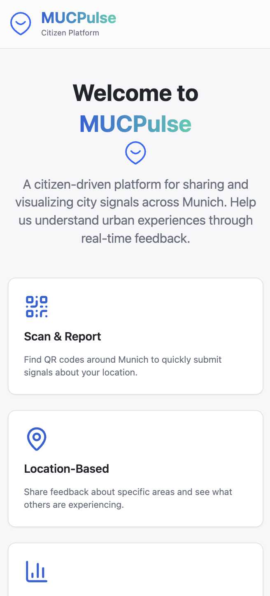
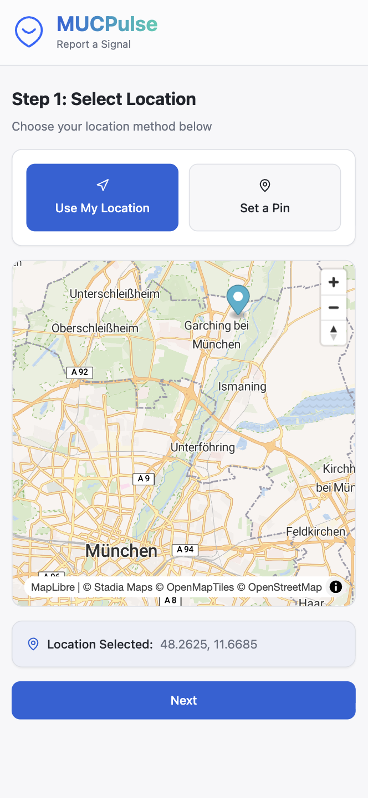
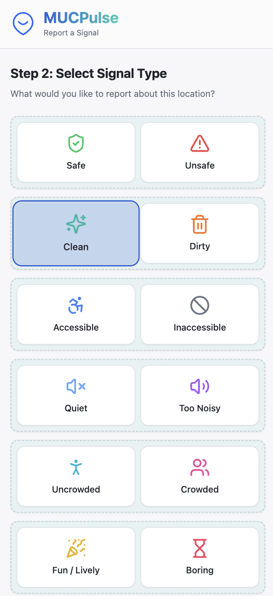
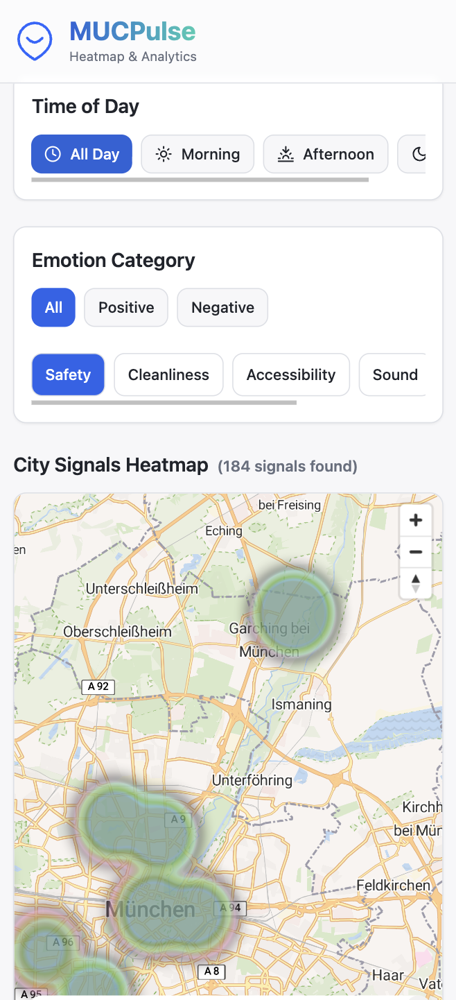
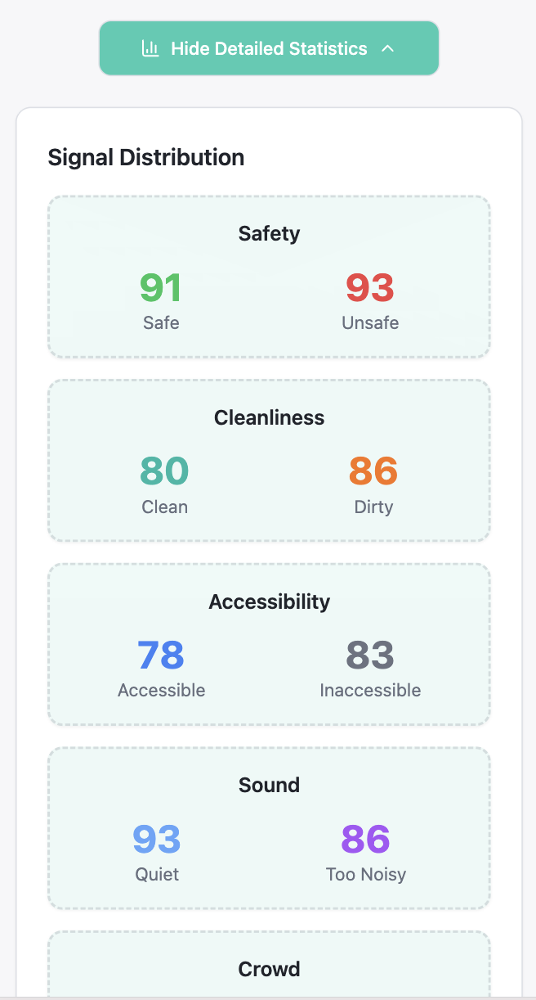

# MUCPulse

## The Emotional Infrastructure of Munich

A living map of how Munich *feels* in real time.
Transforming collective emotion into actionable urban intelligence.

### Screenshots

<table>
  <tr>
    <td align="center">
      
      <br />
      <em>Home Page</em>
    </td>
    <td align="center">
      
      <br />
      <em>Location Selection</em>
    </td>
    <td align="center">
      
      <br />
      <em>Report Signal</em>
    </td>
  </tr>
  <tr>
    <td align="center">
      
      <br />
      <em>Success State</em>
    </td>
    <td align="center">
      
      <br />
      <em>Analytics Filters</em>
    </td>
    <td align="center">
      
      <br />
      <em>Live Statistics</em>
    </td>
  </tr>
</table>

---

## Inspiration

Cities are more than concrete, transit lines, and coordinates. They are living organisms shaped by the emotions of the people who move through them every day — feelings of safety, stress, joy, isolation, comfort, and belonging.

Yet while we can map every street and station with precision, we have no system to capture how it actually *feels* to exist in those spaces.

**MUCPulse changes that.** It transforms the collective emotional experience of Munich into a real-time, interactive map — empowering citizens, informing decision-makers, and revealing the city’s true human rhythm for the first time.

---

## The Problem

Urban planning is traditionally driven by structural data: traffic flow, construction density, zoning laws, and public infrastructure metrics. What’s missing is the emotional layer - how people truly experience these environments.

Questions citizens face daily have no concrete answers:

* Is this park safe after sunset?
* Why does this area feel stressful during rush hour?
* Which streets actually feel welcoming and alive?

Without emotional data, cities grow blind to the lived realities of their communities. This disconnect results in underused public spaces, unsafe zones, and overlooked issues that silently shape everyday life.

Munich deserved a system that listens to its people - not just measures them.

---

## The Solution

**MUCPulse** is a real-time emotional intelligence platform that allows citizens to share how they feel at specific locations, converting subjective experience into structured, visualized insight.

Through an intuitive mobile-first interface and a dynamic heatmap, MUCPulse captures the emotional pulse of the city and presents it as actionable data for both citizens and urban planners.

### What makes MUCPulse different:

* Emotion-first mapping instead of location-only data
* Fully open-source, privacy-respecting geospatial stack
* Live, collective visualization of mood shifts across time
* Designed for scalability from community tool to city-wide intelligence system

---

## Key Features

* **Real-Time Emotion Reporting** – Drop a pin and tag your current feeling
* **Live Emotional Heatmap** – Visualize the collective mood of Munich
* **Time-Based Mood Filters** – See changes by Morning, Afternoon, Night
* **Category Filters** – Safety, Cleanliness, Accessibility, Sound, Crowd, Vibrancy
* **Privacy-Conscious Design** – No personal data stored beyond anonymized signals
* **Live Signal Reflection** – Updates appear each time you reload the page
* **Munich-Focused Bounds** – The experience intelligently locks to the Greater Munich area

---

## How It Works

1. User opens MUCPulse on mobile or desktop
2. Grants location permission (or selects position manually)
3. Chooses an emotion that represents their current feeling
4. Submits the signal
5. A pin is dropped and instantly reflected on the heatmap
6. Aggregated emotions dynamically shape the city’s visual mood layer
7. Users explore trends by time or category

In seconds, one emotion becomes part of Munich’s collective emotional story.

---

## Technology Stack

### Frontend

* **React + Vite** – Lightning-fast rendering and hot reload for rapid iteration
* **Tailwind CSS** – Polished, responsive, and accessible design system

### Mapping & Visualization

* **MapLibre GL** – Fully open-source mapping stack replacing paid providers
* **Custom Heatmap Rendering** – Efficient real-time visual aggregation

### Backend

* **FastAPI (Python)** – High-performance async server for signal handling

### Database

* **PostgreSQL** – Robust storage for geospatial and temporal data

### Geospatial Control

* Custom boundary logic to lock interaction to Greater Munich area

This stack ensures performance, sustainability, privacy, and scalability.

---

## System Architecture Overview

```
User Interface (React)
        ↓
Geolocation Capture
        ↓
FastAPI REST Endpoints
        ↓
PostgreSQL
        ↓
Heatmap Data Aggregation
        ↓
MapLibre Visualization Layer
```

* Frontend captures emotional input and location
* Backend validates and stores anonymized signal
* Database indexes spatial + temporal dimensions
* Aggregation engine feeds live heatmap
* MapLibre renders real-time emotional terrain

A seamless bridge between emotion and infrastructure.

---

## Challenges & Learnings

### Ghost Map Bug

React 18 Strict Mode caused double rendering and collapsing map containers. We solved this with strict ref validation and container containment strategies.

### Privacy vs Precision

Browser geolocation restrictions required layered user guidance and fallback logic to preserve usability without sacrificing trust.

### Data Serialization

Bridging snake_case backend models with camelCase frontend required building a transformation adapter layer.

### What This Taught Us

* Frontend-based filtering dramatically improves UX performance
* Shared type thinking prevents runtime failure
* Emotional transparency earns user trust

---

## Impact & Future Vision

### Short-Term

* Crowd-sourced safety awareness
* Community-driven urban feedback
* Real-time civic engagement

### Long-Term

* Data Interpretation AI Assistants 
* Advanced dashboards that translate emotional data into actionable insights for city planners and policymakers.
* Precision Urban Focus - more specialised use-cases (e.g. safety corridors, mental well-being zones, nightlife analytics) with deeper, high-resolution datasets
* Scalable City Replication

MUCPulse envisions a world where cities listen, adapt, and evolve based on human truth — not just hard data.

---

## Installation & Setup

```bash
# Clone repository
git clone https://github.com/your-username/mucpulse.git
cd mucpulse
```

### Frontend

```bash
cd frontend
npm install
npm run dev
```

### Backend

```bash
cd backend
python3 -m venv venv
source venv/bin/activate
pip install -r requirements.txt
uvicorn app.main:app --reload
```

## Contributors & Acknowledgements

Built with passion at **HackaTUM 2025**

### Core Team

* Serzhan Kenesbek
* Kim Ngan Nguyen
* Lena Elisabeth Holtmannspötter

Special thanks to:

* HackaTUM organizers
* Lovable AI
* Cursor AI
* The people of Munich

---

## Final Words

MUCPulse is not just a hackathon project — it is the foundation of emotional urban intelligence.

A system where voices become visibility.
Where experience becomes data.
Where cities learn how to feel.
